# mc-bedrock-secret-emojis
read the title

## How to use
Copy the unicode character and paste it into Minecraft: Bedrock Edition chats, signs, titles etc.

## How does it work?
Minecraft uses resource packs to assign characters (glyphs) to different unicode values, which is how the game allows you to type in chat and write on signs etc. Because fonts are just textures in a resource pack, it also allows the game to add "emojis" which have their own unicode values assign to them just like letters.

## List of all characters

|               Name               |   Platform   | Character | Unicode |                In game                 |
|:--------------------------------:|:------------:|:---------:|:-------:|:------------------------------- ------:|
|             A Button             |    Xbox     |          |  U+E000 |                        |
|             B Button             |    Xbox     |          |  U+E001 |                        |
|             X Button             |    Xbox     |          |  U+E002 |            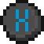            |
|             Y Button             |    Xbox     |          |  U+E003 |                        |
|             LB Button            |    Xbox     |          |  U+E004 |                       |
|             RB Button            |    Xbox     |          |  U+E005 |                       |
|             LT Button            |    Xbox     |          |  U+E006 |                       |
|             RT Button            |    Xbox     |          |  U+E007 |                       |
|           Select Button          |    Xbox     |          |  U+E008 |                   |
|           Start Button           |    Xbox     |          |  U+E009 |                    |
|         Left Stick Button        |    Xbox     |          |  U+E00A |                       |
|        Right Stick Button        |    Xbox     |          |  U+E00B |                       |
|          D-Pad Up Button         |    Xbox     |          |  U+E00C |                     |
|         D-Pad Left Button        |    Xbox     |          |  U+E00D |                   |
|         D-Pad Down Button        |    Xbox     |          |  U+E00E |                   |
|        D-Pad Right Button        |    Xbox     |          |  U+E00F |                  |
|          A Button Bright         |    Xbox     |          |  U+E010 |                 |
|          B Button Bright         |    Xbox     |          |  U+E011 |                 |
|          X Button Bright         |    Xbox     |          |  U+E012 |                 |
|          Y Button Bright         |    Xbox     |          |  U+E013 |                 |
|               Jump               |    Mobile   |          |  U+E014 |                          |
|              Attack              |    Mobile   |          |  U+E015 |                        |
|             Joystick             |    Mobile   |          |  U+E016 |                      |
|             Crosshair            |    Mobile   |          |  U+E017 |                     |
|             Interact             |    Mobile   |          |  U+E018 |                      |
|              Crouch              |    Mobile   |          |  U+E019 |            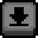            |
|              Sprint              |    Mobile   |          |  U+E01A |                        |
|              Fly Up              |    Mobile   |          |  U+E01B |                        |
|             Fly Down             |    Mobile   |          |  U+E01C |                      |
|             Dismount             |    Mobile   |          |  U+E01D |                       |
|           Cross Button           | PlayStation |          |  U+E020 |                          |
|           Circle Button          | PlayStation |          |  U+E021 |                          |
|           Square Button          | PlayStation |          |  U+E022 |                     |
|          Triangle Button         | PlayStation |          |  U+E023 |                   |
|             L1 Button            | PlayStation |          |  U+E024 |                         |
|             R1 Button            | PlayStation |          |  U+E025 |                         |
|             L2 Button            | PlayStation |          |  U+E026 |                         |
|             R2 Button            | PlayStation |          |  U+E027 |                         |
|           Select Button          | PlayStation |          |  U+E028 |                     |
|           Start Button           | PlayStation |          |  U+E029 |           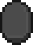           |
|         Left Stick Button        | PlayStation |          |  U+E02A |                         |
|        Right Stick Button        | PlayStation |          |  U+E02B |                         |
|          D-Pad Up Button         | PlayStation |          |  U+E02C |                       |
|         D-Pad Left Button        | PlayStation |          |  U+E02D |                     |
|         D-Pad Down Button        | PlayStation |          |  U+E02E |                     |
|        D-Pad Right Button        | PlayStation |          |  U+E02F |                    |
|             A Button             |   Switch    |          |  U+E040 |                    |
|             B Button             |   Switch    |          |  U+E041 |                    |
|             X Button             |   Switch    |          |  U+E042 |                    |
|             Y Button             |   Switch    |          |  U+E043 |                    |
|             L Button             |   Switch    |          |  U+E044 |                    |
|             R Button             |   Switch    |          |  U+E045 |                    |
|             ZL Button            |   Switch    |          |  U+E046 |                   |
|             ZR Button            |   Switch    |          |  U+E047 |          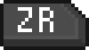         |
|             - Button             |   Switch    |          |  U+E048 |                |
|             + Button             |   Switch    |          |  U+E049 |                 |
|         Left Stick Button        |   Switch    |          |  U+E04A |                   |
|        Right Stick Button        |   Switch    |          |  U+E04B |                   |
|          D-Pad Up Button         |   Switch    |          |  U+E04C |                 |
|         D-Pad Left Button        |   Switch    |          |  U+E04D |               |
|         D-Pad Down Button        |   Switch    |          |  U+E04E |               |
|        D-Pad Right Button        |   Switch    |          |  U+E04F |              |
|         Left Mouse Button        |   Windows   |          |  U+E060 |                    |
|        Right Mouse Button        |   Windows   |          |  U+E061 |                   |
|        Middle Mouse Button       |   Windows   |          |  U+E062 |                  |
|               Mouse              |   Windows   |          |  U+E063 |             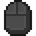            |
|         Forward Arrow New        |    Mobile   |          |  U+E065 |             |
|          Right Arrow New         |    Mobile   |          |  U+E066 |               |
|           Down Arrow New         |    Mobile   |          |  U+E067 |                |
|           Left Arrow New         |    Mobile   |          |  U+E068 |                |
|          Jump Button New         |    Mobile   |          |  U+E069 |               |
|         Crouch Button New        |    Mobile   |          |  U+E06A |             |
|          Inventory Button        |    Mobile   |          |  U+E06B |              |
|         Fly Up Button New        |    Mobile   |          |  U+E06C |        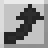     |
|        Fly Down Button New       |    Mobile   |          |  U+E06D |           |
|       Left Mouse Button New      |   Windows   |          |  U+E070 |                |
|       Right Mouse Button New     |   Windows   |          |  U+E071 |               |
|      Middle Mouse Button New     |   Windows   |          |  U+E072 |        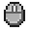      |
|             Mouse New            |   Windows   |          |  U+E073 |                     |
|        Foward Arrow Button       |    Mobile   |          |  U+E080 |         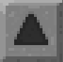        |
|         Left Arrow Button        |    Mobile   |          |  U+E081 |                    |
|      Backwards Arrow Button      |    Mobile   |          |  U+E082 |                    |
|        Right Arrow Button        |    Mobile   |          |  U+E083 |                   |
|            Jump Button           |    Mobile   |          |  U+E084 |                   |
|           Crouch Button          |    Mobile   |          |  U+E085 |                 |
|           Fly Up Button          |    Mobile   |          |  U+E086 |         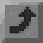        |
|          Fly Down Button         |    Mobile   |          |  U+E087 |        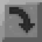       |
|        Craftable Toggle On       |     All     |          |  U+E0A0 |                  |
|       Craftable Toggle Off       |     All     |          |  U+E0A1 |         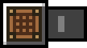        |
|             Food Icon            |     All     |          |  U+E100 |             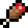             |
|            Armor Icon            |     All     |          |  U+E101 |                        |
|             Minecoin             |     All     |          |  U+E102 |                      |
|        Code Builder Button       |     All     |          |  U+E103 |                  |
|      Immersive Reader Button     |     All     |          |  U+E104 |       |
|               Token              |     All     |          |  U+E105 |                         |
|            Hollow Star           |     All     |          |  U+E106 |                   |
|             Solid Star           |     All     |          |  U+E107 |                    |
|         Left Grab Button         |  Windows MR |          |  U+E0C0 |                         |
|         Right Grab Button        |  Windows MR |          |  U+E0C1 |             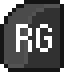            |
|            Menu Button           |  Windows MR |          |  U+E0C2 |                       |
|         Left Stick Button        |  Windows MR |          |  U+E0C3 |                         |
|        Right Stick Button        |  Windows MR |          |  U+E0C4 |                         |
|       Left Touchpad Button       |  Windows MR |          |  U+E0C5 |              |
|  Left Touchpad Horizontal Button |  Windows MR |          |  U+E0C6 |   |
|   Left Touchpad Vertical Button  |  Windows MR |          |  U+E0C7 |     |
|       Right Touchpad Button      |  Windows MR |          |  U+E0C8 |             |
| Right Touchpad Horizontal Button |  Windows MR |          |  U+E0C9 |  |
|  Right Touchpad Vertical Button  |  Windows MR |          |  U+E0CA |    |
|        Left Trigger Button       |  Windows MR |          |  U+E0CB |                         |
|       Right Trigger Button       |  Windows MR |          |  U+E0CC |                         |
|              Windows             |  Windows MR |          |  U+E0CD |                    |
|             0 Button             |     Rift    |          |  U+E0E0 |                     |
|             A Button             |     Rift    |          |  U+E0E1 |            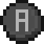            |
|             B Button             |     Rift    |          |  U+E0E2 |                        |
|         Left Grab Button         |     Rift    |          |  U+E0E3 |                         |
|         Right Grab Button        |     Rift    |          |  U+E0E4 |                         |
|         Left Stick Button        |     Rift    |          |  U+E0E5 |                       |
|        Right Stick Button        |     Rift    |          |  U+E0E6 |                       |
|        Left Trigger Button       |     Rift    |          |  U+E0E7 |                       |
|       Right Trigger Button       |     Rift    |          |  U+E0E8 |                       |
|             X Button             |     Rift    |          |  U+E0E9 |                        |
|             Y Button             |     Rift    |          |  U+E0EA |                        |
